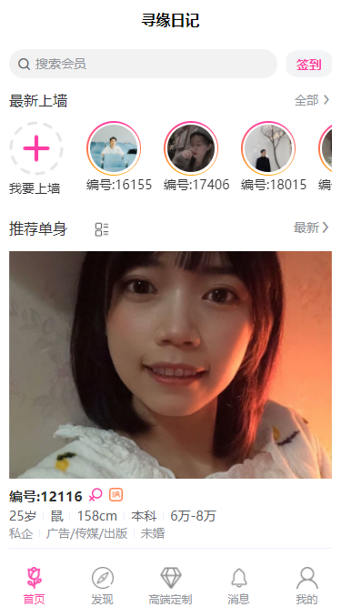
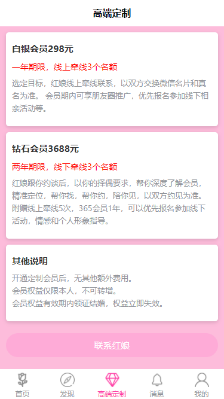
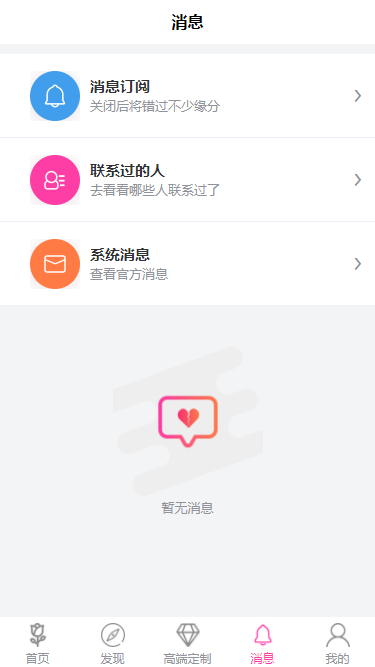
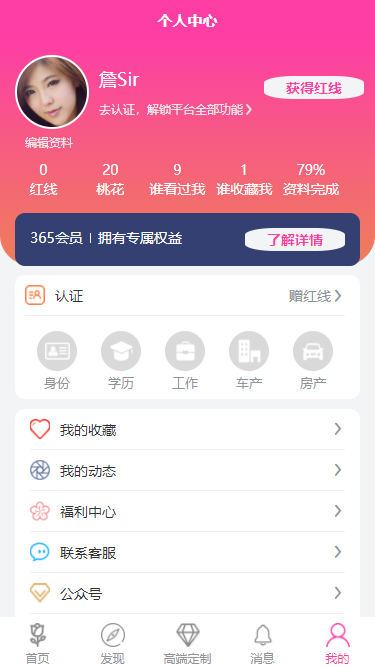

```
🕙 分享是一种美德，右上随手点个 🌟 Star，谢谢 
```

### 介绍
使用uniapp开发的相亲平台

### 说明
此项目是一个招商项目，目前已完成前台开发。源码结构清晰，完美实现模块化组件化思想，易维护。有志运营“智慧相亲”可联系本人共同商讨。

### 关于我们
曾经，作者也为寻求自己的另一半苦恼，因为平时工作繁忙，交际圈窄小，而父母又各种催婚，无奈上了“XX网”去碰碰运气。
好不容易，在它的相亲资料库里看到自己心仪的对象，于是找红娘前去索要联系方式，被告知至少需要交1280元会员费（半年为期，可自由选择12个会员编号）。
尼玛，虽说现在是知识付费时代，但这也太贵了，对于工薪阶层的我来说，可是一笔不小的开支，而且或许我只需要联系上一个人就情定终身了呢，那我的钱不是白白浪费了嘛！
就没有按次付费的吗？“XX网”答复没有，必须至少先交1280元。
于是，我思前想后，开发“寻缘日记”，帮助拥有同样烦恼的你。 

### 项目地址
手机端：http://8.136.213.245/#/

### 部分截图






### 作者信息

1.  作者：詹Sir
2.  邮箱：261648947@qq.com
3.  官网：sourcebyte.cn

### 交流群


## 结语

欢迎一起探讨，如果你觉得还可以，您可以给我点一个star